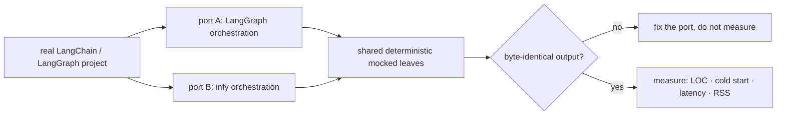
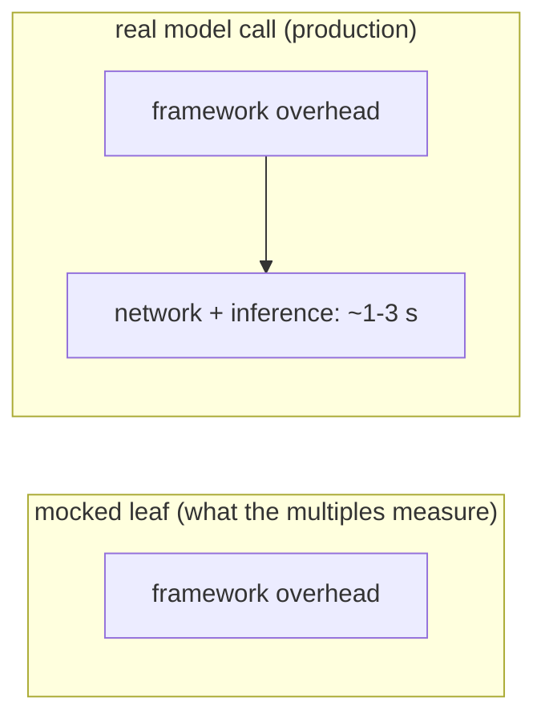

# Benchmarks

This document records how infy is measured against LangChain/LangGraph, the raw numbers, and,
deliberately, the cases where infy does *not* win. The goal is a number you can trust, not
a number that flatters.

## Methodology

Framework overhead is isolated by porting real LangChain/LangGraph projects to infy and
replacing the LLM call with a **deterministic, offline leaf** (no API keys, no GPU, no
network). Only the orchestration differs between the two ports, so the difference *is* the
framework. Every port is verified to produce **byte-identical output** before any timing is
trusted.



**Metrics**

| Metric | Definition |
| --- | --- |
| Orchestration LOC | Logical lines (tokenised `NEWLINE` count) of the orchestration file; shared mock leaves excluded. |
| Cold start | Fresh interpreter → import framework + compile graph, in a subprocess; **minimum of 6 runs**. |
| Loop latency | Per-`invoke` framework overhead over the scenario suite (mocked leaves), µs or ms. |
| RSS over baseline | Peak resident memory of (import + build + run) minus a bare-interpreter baseline (psutil). |

**Environment.** Windows, CPython 3.13, virtualenv. Release build of the Rust core
(`maturin develop --release`). LangGraph 1.x / langchain-core 1.x. Numbers are
machine-relative; the **ratios** are the portable result, not the absolute milliseconds.

---

## Headline

Across a corpus of about 37 community agents (offline, framework overhead isolated), median:

| Dimension | infy vs LangChain/LangGraph |
| --- | --- |
| Cold start (import + compile) | **8.6x faster** |
| Resident memory | **5.4x lighter** |
| Per-invocation framework overhead | **21x lower** |
| Orchestration LOC | parity |

Conservative view, on the seven heavier ported projects below:

| Dimension | infy vs LangChain/LangGraph |
| --- | --- |
| Cold start | **2.7x to 6.8x faster** |
| Resident memory | **2.7x to 5.5x lower** |
| Per-invocation framework overhead | **12x to 93x lower** |
| Orchestration LOC | parity to moderately smaller |

The per-invocation multiples are real but workload-dependent, and in production they **amortize
into network latency** (see [The honest caveat](#the-honest-caveat)).

---

## Per-project results (offline, framework overhead isolated)

| # | Project | Shape | LOC | Cold start | Loop latency | RSS |
| --- | --- | --- | --: | --: | --: | --: |
| 01 | Medical-assistant agent | 11-node decision graph, vision routing | 0.96x | 4.48x | 29.98x | 5.04x |
| 02 | Research / ReAct agent | cyclic ReAct + structured router | 1.16x | 3.91x | 12.46x | 3.08x |
| 03 | Multi-analyst finance agent | fan-out to 10 analysts + reducers | 1.10x | 3.63x | 29.96x | 2.68x |
| 04 | Browser-automation agent | per-step pydantic agent (not LangGraph) | n/a | 0.69x | 1.67x/step | 1.23x |
| 05 | Software-engineering agent | architect subgraph + developer, pydantic state | 1.16x | 3.98x | **47.14x** | 3.08x |
| 06 | Data-generation agent | supervisor hub-and-spoke, cyclic revision | 1.20x | 5.55x | 19.34x | 5.00x |
| 07 | Terminal / CLI agent | LangChain 1.0 agent middleware | 1.18x | 6.78x | **93.15x** | 5.51x |

LOC values are infy-relative: `>1.0` means infy is smaller. The latency advantage scales
with how much framework machinery the incumbent layers on: pydantic state, LCEL structured
output, nested subgraphs, middleware stacks.

### Cold start: infy x faster (higher is better)

```
07 terminal / CLI    ████████████████████████████████████████  6.78x
06 data-generation   █████████████████████████████████         5.55x
01 medical assistant ██████████████████████████                4.48x
05 software-eng      ███████████████████████                   3.98x
02 research / ReAct  ███████████████████████                   3.91x
03 finance analysts  █████████████████████                     3.63x
```

### Resident memory: infy x lower (higher is better)

```
07 terminal / CLI    ████████████████████████████████████████  5.51x
01 medical assistant █████████████████████████████████████     5.04x
06 data-generation   ████████████████████████████████████      5.00x
02 research / ReAct  ██████████████████████                    3.08x
05 software-eng      ██████████████████████                    3.08x
03 finance analysts  ███████████████████                       2.68x
```

---

## Corpus run (a broad set of community agents)

Beyond the seven heavier projects, the same harness was run across a public collection of
roughly fifty community agent tutorials: small-to-medium LangGraph and LangChain agents
spanning support routing, planning, research, analysis, memory, multi-agent coordination, and
content generation. Each was ported to both frameworks over a shared deterministic leaf,
verified byte-identical, then measured identically.

**Coverage.** 37 ported and verified; 12 documented as out of scope (built on a different
framework, or driven by a live external service (web search, image or audio generation, a
real vector store, or MCP servers) that cannot be reduced to a deterministic offline leaf);
2 did not reach byte-identical parity and were dropped rather than reported. Gaps are
documented, not forced: no infy feature was added to win a port.

**Result across the 37 (infy vs LangChain/LangGraph, offline, framework overhead isolated):**

| Dimension | Median | Range |
| --- | --- | --- |
| Cold start | **8.6x faster** | 2.5x to 9.9x |
| Resident memory | **5.4x lower** | 1.9x to 8.1x |
| Per-invocation framework overhead | **21x lower** | 10x to 609x |
| Orchestration LOC | **parity** (1.00x) | 0.92x to 1.74x |

These lighter graphs cluster higher on cold start (most land near 8 to 9x) than the heavier
seven, because there is less per-graph work to dilute infy's lean import. The LOC story is the
quiet one: most ports are the LangGraph file with a single import line changed, so parity is
expected; a handful came out meaningfully smaller (up to 1.74x).

**Representative ports** (ratio = infy advantage; LangChain/LangGraph time ÷ infy time):

| Agent | LOC | Cold start | Loop latency | RSS |
| --- | --: | --: | --: | --: |
| Customer-support router (categorise, sentiment, route, escalate) | 1.00x | 8.6x | 20.0x | 5.5x |
| Tabular data-analysis agent (tool loop over a dataframe) | 1.74x | 9.9x | 265x | 7.1x |
| Task-planning agent (decompose a goal into ordered steps) | 1.55x | 9.5x | 381x | 8.1x |
| Multi-step travel planner | 1.00x | 9.4x | 18.6x | 5.4x |
| Memory-augmented conversational agent | 1.02x | 8.7x | 314x | 5.4x |
| Supervisor multi-agent collaboration | 1.00x | 8.3x | 28.4x | 5.0x |
| Scientific-paper research agent | 1.00x | 8.4x | 20.7x | 5.3x |
| Self-improving (critique-and-retry) agent | 1.13x | 8.8x | 268x | 5.7x |
| Interactive narrative state machine | 1.00x | 8.8x | 17.6x | 5.0x |
| News summariser | 1.00x | 8.6x | 16.9x | 5.7x |
| Market-insight agent | 1.00x | 8.5x | 19.3x | 5.3x |
| Academic task-planning agent (smallest graph) | 1.00x | 2.5x | 49.1x | 1.9x |

The last row is the honest low end: the smallest graph, where the framework does the least, so
infy's cold-start edge shrinks to 2.5x and memory to 1.9x. The per-invocation outliers
(265x to 609x) are the simplest agents, where the incumbent's per-superstep machinery is almost
the entire cost; as everywhere, that overhead amortises into the live model call in production.

---

## Live-model runs (real API, Vertex AI / `gemini-2.5-flash`)

The only non-mocked runs. Both ports call the real model; structured extraction at
`temperature=0`, identical validated output.

| Run | Auth | LangChain side | LOC | Cold start | Wall-clock | RSS |
| --- | --- | --- | --: | --: | --: | --: |
| Express (free tier) | API key | thin custom `BaseChatModel` over shared transport | 2.50x | 1.26x | **1.14x** | 1.20x |
| **Billed, native** | gcloud OAuth | **real `ChatVertexAI`** (full Vertex stack) | 0.67x | **2.75x** | **1.05x** | **3.71x** |

The billed native run is the truest comparison: LangChain uses its actual
`google-cloud-aiplatform` provider (≈270 MB resident, ≈4 s import) versus infy on
`google-genai` (≈73 MB, ≈1.5 s). Wall-clock is at parity because the ~1.6 s network
round-trip dominates. The LOC flips to infy-larger only because `GeminiChat` lacks
`project`/`location`/`credentials` arguments and needs a 3-line client injection, a known,
small gap.

---

## Component-level: the LCEL / parser tax

Isolates LangChain's `ChatPromptTemplate | model | parser` machinery against infy's manual
prompt + Rust `JsonParser`. Only the LLM `_generate` is faked; templating, dispatch, and
parsing are real. Microseconds per operation.

| Operation | LangChain | infy | Speedup |
| --- | --: | --: | --: |
| Full decision pipeline (template + LCEL + dispatch + parse) | 440.9 µs | 7.3 µs | **60.7x** |
| Parse markdown-fenced JSON | 723.8 µs | 1.4 µs | **531.8x** |
| Parse (PydanticOutputParser vs infy) | 9.9 µs | 1.1 µs | 9.2x |
| Parse (JsonOutputParser vs infy) | 6.5 µs | 1.1 µs | 6.0x |
| Parse 3 KB structured payload | 25.9 µs | 22.1 µs | 1.2x |

The Rust advantage is largely **fixed per-call overhead**: on a 3 KB payload it shrinks to
1.2x because materialising the parsed result as Python objects dominates either way. infy's
parser is a low-overhead, fast-on-small-and-fenced story, not a large-JSON throughput story.

---

## Governance overhead: is it free enough to leave on?

infy's governance layer (policy + risk + tamper-evident audit) runs **in-process** at the tool
chokepoint, so the question is whether it is cheap enough to enable on every agent. Measured on a
real `create_agent` loop (an incident responder issuing 5 tool calls), four arms producing
byte-identical output:

| arm | cold start | RSS over baseline | latency / run |
| --- | --: | --: | --: |
| infy (ungoverned) | 129 ms | 9.2 MB | 0.019 ms |
| infy + governance | 145 ms | 10.7 MB | 0.246 ms |
| LangChain (ungoverned) | 980 ms | 54.6 MB | 8.3 ms |
| LangChain + middleware | 967 ms | 54.8 MB | 9.2 ms |

- **infy governance overhead: ≈ +50 µs per tool call** (+230 to 285 µs/run for 5 calls), stable
  across runs. That dominates the *mocked* 19 µs run, but against the ~1 to 2 s real LLM call it
  guards, it is **~0.003%** overhead. Governance is free enough to leave on for every agent.
- **infy + governance vs LangChain + equivalent middleware** (same policy + audit work):
  **~6 to 9x lighter cold start, ~5x lighter RAM, ~38 to 43x faster per run**, and infy's governance
  does *more* per call (risk tiering + a hash-chained audit event), because enforcement is a plain
  in-process function call, not a graph step.

Honest caveat: the LangChain middleware delta (+0.3 to 2.6 ms/run) is real but lost in the run-to-run
noise of its ~8 to 13 ms graph execution, so it is reported, not relied on. Full harness and threat
model: [`infy/governance/README.md`](infy/governance/README.md).

---

## Tool routing: what does a large catalogue cost?

Every benchmark above measures CPU and memory. This one measures **context**, the cost a large
tool catalogue imposes on every model call. One agent run = a single tool call against a
**120-tool catalogue** (twelve real service domains x ten operations, four-property typed schemas),
mocked and deterministic, all arms reaching the identical answer. Token counts are measured off
the real serialised payload with infy's `count_tokens` (a fast approximation, not a provider BPE).

| arm | turn-1 tokens | tool tokens/run | pool tokens/run | total | latency/run |
| --- | --: | --: | --: | --: | --: |
| static (all 120 schemas) | 23,917 | 47,834 | 0 | **47,834** | 5,994 µs |
| routed (top-5) | 1,000 | 2,000 | 3,532 | **5,532** | 1,187 µs |
| routed (top-3) | 600 | 1,200 | 3,532 | **4,732** | 995 µs |

- **8.6x less context** at top-5 (88.4% saved), 10.1x at top-3 — and the static figure is a floor,
  since the schemas are re-sent on every iteration.
- **The summary pool is not free.** At 1,766 tokens per turn it is 64% of the routed arm's total.
  The saving comes from the schemas (47,834 → 2,000), not from the pool being cheap.
- **Routing is also faster, not a latency trade: 5x per run.** Serialising 120 schemas twice costs
  more than ranking 120 tools and serialising 5. Decomposed: **297 µs per selection** (BM25 over an
  inverted index), 0.2 µs to emit the pool (rendered once), and a one-time ~4 ms index build at
  startup. Against the ~1–2 s LLM call it feeds, selection is **~0.02%** overhead.
- **Cold start and RSS are unchanged** (356 vs 355 ms, 9.2 vs 9.3 MB — run-to-run noise). Routing
  changes what goes in the prompt, not what gets imported.

Honest caveats: this is a single-tool-call scenario, so 8.6x is the favourable end of a real range
— a run needing tools from several domains promotes more of them and saves less. Below roughly
15–20 tools the pool costs more than the schemas it replaces and routing is a net loss. And a
paraphrased query with no lexical overlap can miss, which is what `always=` pinning, the prose
escape hatch, and the optional dense path exist to cover. Full harness and the rest of the
caveats: [`tool_routing_bench/`](tool_routing_bench/).

---

## Where infy loses (and what changed)

Project 04 (the browser-automation agent) is the honest counter-example. Per LLM step:

| Operation | incumbent | infy | Result |
| --- | --: | --: | --- |
| Construct messages | 27.7 µs | 8.4 µs | infy 3.3x faster |
| Serialise to OpenAI format | 3.5 µs | 5.3 µs | infy 0.65x (slower) |
| Parse structured action | 4.4 µs | 8.7 µs | infy 0.51x (slower) |
| Full step | 38.1 µs | 22.8 µs | infy 1.67x faster |

infy was net-faster per step (frozen dataclasses construct 3.3x faster than validated
pydantic models) but **lost on validated parsing**: the incumbent used `pydantic-core`'s
`model_validate_json` (fused single-pass parse+validate), which beat infy's
`JsonParser → dict → construct` two-pass. **This has since been addressed**, infy's
`with_structured_output` now delegates to `pydantic-core.model_validate_json` when given a
pydantic model, taking the same fused path.

---

## The honest caveat

The per-invocation overhead multiples (12x to 93x) measure a real CPU cost, but they describe the
*framework's* time, not the request's. Once a live model call is in the loop, a ~1 to 3 s network
round-trip dominates, and end-to-end wall-clock between frameworks is effectively at parity
(measured: 1.05x to 1.14x).



What survives into production is **cold start** and **memory footprint**, costs paid on every
request and per running agent. That is why infy targets serverless, edge, and high-density
multi-tenant deployments, where those are the dominant terms.

---

## Reproduction

The benchmark harness (ported projects + measurement scripts) is kept out of the published
package. The methodology above is sufficient to reproduce the shape of the results: port a
project to both frameworks, share a deterministic leaf, verify byte-identical output, then
measure LOC, subprocess cold start, per-invoke latency, and RSS over a bare-interpreter
baseline. Ratios are portable across machines; absolute timings are not.
