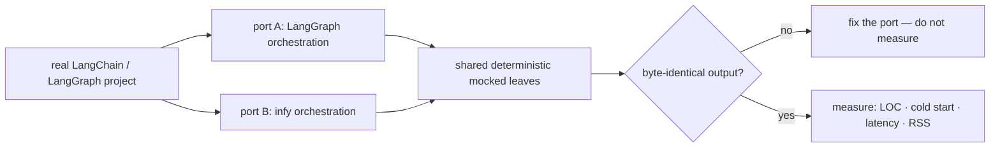
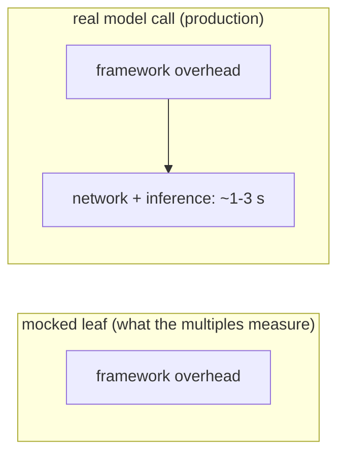

# Benchmarks

This document records how infy is measured against LangChain/LangGraph, the raw numbers, and
— deliberately — the cases where infy does *not* win. The goal is a number you can trust, not
a number that flatters.

## Methodology

Framework overhead is isolated by porting real LangChain/LangGraph projects to infy and
replacing the LLM call with a **deterministic, offline leaf** (no API keys, no GPU, no
network). Only the orchestration differs between the two ports, so the difference *is* the
framework. Every port is verified to produce **byte-identical output** before any timing is
trusted.



**Metrics**

| Metric | Definition |
| --- | --- |
| Orchestration LOC | Logical lines (tokenised `NEWLINE` count) of the orchestration file; shared mock leaves excluded. |
| Cold start | Fresh interpreter → import framework + compile graph, in a subprocess; **minimum of 6 runs**. |
| Loop latency | Per-`invoke` framework overhead over the scenario suite (mocked leaves), µs or ms. |
| RSS over baseline | Peak resident memory of (import + build + run) minus a bare-interpreter baseline (psutil). |

**Environment.** Windows, CPython 3.13, virtualenv. Release build of the Rust core
(`maturin develop --release`). LangGraph 1.x / langchain-core 1.x. Numbers are
machine-relative; the **ratios** are the portable result, not the absolute milliseconds.

---

## Headline

Across seven ported projects (offline, framework overhead isolated):

| Dimension | infy vs LangChain/LangGraph |
| --- | --- |
| Cold start | **2.7x – 6.8x faster** |
| Resident memory | **2.7x – 5.5x lower** |
| Per-invocation framework overhead | **12x – 93x lower** |
| Orchestration LOC | parity to moderately smaller |

The per-invocation multiples are real but workload-dependent and, in production, **amortise
into network latency** — see [The honest caveat](#the-honest-caveat).

---

## Per-project results (offline, framework overhead isolated)

| # | Project | Shape | LOC | Cold start | Loop latency | RSS |
| --- | --- | --- | --: | --: | --: | --: |
| 01 | Multi-Agent Medical Assistant | 11-node decision graph, vision routing | 0.96x | 4.48x | 29.98x | 5.04x |
| 02 | SRAgent | cyclic ReAct + structured router | 1.16x | 3.91x | 12.46x | 3.08x |
| 03 | ai-hedge-fund | fan-out to 10 analysts + reducers | 1.10x | 3.63x | 29.96x | 2.68x |
| 04 | browser-use | per-step pydantic agent (not LangGraph) | n/a | 0.69x | 1.67x/step | 1.23x |
| 05 | swe-agent | architect subgraph + developer, pydantic state | 1.16x | 3.98x | **47.14x** | 3.08x |
| 06 | DATAGEN | supervisor hub-and-spoke, cyclic revision | 1.20x | 5.55x | 19.34x | 5.00x |
| 07 | terminal_agent | LangChain 1.0 agent middleware | 1.18x | 6.78x | **93.15x** | 5.51x |

LOC values are infy-relative: `>1.0` means infy is smaller. The latency advantage scales
with how much framework machinery the incumbent layers on — pydantic state, LCEL structured
output, nested subgraphs, middleware stacks.

### Cold start — infy x faster (higher is better)

```
07 terminal_agent  ████████████████████████████████████████  6.78x
06 DATAGEN         █████████████████████████████████         5.55x
01 medical         ██████████████████████████                4.48x
05 swe-agent       ███████████████████████                   3.98x
02 sragent         ███████████████████████                   3.91x
03 hedge-fund      █████████████████████                     3.63x
```

### Resident memory — infy x lower (higher is better)

```
07 terminal_agent  ████████████████████████████████████████  5.51x
01 medical         █████████████████████████████████████     5.04x
06 DATAGEN         ████████████████████████████████████      5.00x
02 sragent         ██████████████████████                    3.08x
05 swe-agent       ██████████████████████                    3.08x
03 hedge-fund      ███████████████████                       2.68x
```

---

## Live-model runs (real API, Vertex AI / `gemini-2.5-flash`)

The only non-mocked runs. Both ports call the real model; structured extraction at
`temperature=0`, identical validated output.

| Run | Auth | LangChain side | LOC | Cold start | Wall-clock | RSS |
| --- | --- | --- | --: | --: | --: | --: |
| Express (free tier) | API key | thin custom `BaseChatModel` over shared transport | 2.50x | 1.26x | **1.14x** | 1.20x |
| **Billed, native** | gcloud OAuth | **real `ChatVertexAI`** (full Vertex stack) | 0.67x | **2.75x** | **1.05x** | **3.71x** |

The billed native run is the truest comparison: LangChain uses its actual
`google-cloud-aiplatform` provider (≈270 MB resident, ≈4 s import) versus infy on
`google-genai` (≈73 MB, ≈1.5 s). Wall-clock is at parity because the ~1.6 s network
round-trip dominates. The LOC flips to infy-larger only because `GeminiChat` lacks
`project`/`location`/`credentials` arguments and needs a 3-line client injection — a known,
small gap.

---

## Component-level: the LCEL / parser tax

Isolates LangChain's `ChatPromptTemplate | model | parser` machinery against infy's manual
prompt + Rust `JsonParser`. Only the LLM `_generate` is faked; templating, dispatch, and
parsing are real. Microseconds per operation.

| Operation | LangChain | infy | Speedup |
| --- | --: | --: | --: |
| Full decision pipeline (template + LCEL + dispatch + parse) | 440.9 µs | 7.3 µs | **60.7x** |
| Parse markdown-fenced JSON | 723.8 µs | 1.4 µs | **531.8x** |
| Parse (PydanticOutputParser vs infy) | 9.9 µs | 1.1 µs | 9.2x |
| Parse (JsonOutputParser vs infy) | 6.5 µs | 1.1 µs | 6.0x |
| Parse 3 KB structured payload | 25.9 µs | 22.1 µs | 1.2x |

The Rust advantage is largely **fixed per-call overhead**: on a 3 KB payload it shrinks to
1.2x because materialising the parsed result as Python objects dominates either way. infy's
parser is a low-overhead, fast-on-small-and-fenced story — not a large-JSON throughput story.

---

## Governance overhead — is it free enough to leave on?

infy's governance layer (policy + risk + tamper-evident audit) runs **in-process** at the tool
chokepoint, so the question is whether it is cheap enough to enable on every agent. Measured on a
real `create_agent` loop (an incident responder issuing 5 tool calls), four arms producing
byte-identical output:

| arm | cold start | RSS over baseline | latency / run |
| --- | --: | --: | --: |
| infy (ungoverned) | 129 ms | 9.2 MB | 0.019 ms |
| infy + governance | 145 ms | 10.7 MB | 0.246 ms |
| LangChain (ungoverned) | 980 ms | 54.6 MB | 8.3 ms |
| LangChain + middleware | 967 ms | 54.8 MB | 9.2 ms |

- **infy governance overhead: ≈ +50 µs per tool call** (+230–285 µs/run for 5 calls), stable
  across runs. That dominates the *mocked* 19 µs run — but against the ~1–2 s real LLM call it
  guards, it is **~0.003%** overhead. Governance is free enough to leave on for every agent.
- **infy + governance vs LangChain + equivalent middleware** (same policy + audit work):
  **~6–9× lighter cold start, ~5× lighter RAM, ~38–43× faster per run** — and infy's governance
  does *more* per call (risk tiering + a hash-chained audit event), because enforcement is a plain
  in-process function call, not a graph step.

Honest caveat: the LangChain middleware delta (+0.3–2.6 ms/run) is real but lost in the run-to-run
noise of its ~8–13 ms graph execution, so it is reported, not relied on. Full harness and threat
model: [`infy/governance/README.md`](infy/governance/README.md).

---

## Where infy loses (and what changed)

Project 04 (browser-use) is the honest counter-example. Per LLM step:

| Operation | browser-use | infy | Result |
| --- | --: | --: | --- |
| Construct messages | 27.7 µs | 8.4 µs | infy 3.3x faster |
| Serialise to OpenAI format | 3.5 µs | 5.3 µs | infy 0.65x (slower) |
| Parse structured action | 4.4 µs | 8.7 µs | infy 0.51x (slower) |
| Full step | 38.1 µs | 22.8 µs | infy 1.67x faster |

infy was net-faster per step (frozen dataclasses construct 3.3x faster than validated
pydantic models) but **lost on validated parsing**: browser-use used `pydantic-core`'s
`model_validate_json` (fused single-pass parse+validate), which beat infy's
`JsonParser → dict → construct` two-pass. **This has since been addressed** — infy's
`with_structured_output` now delegates to `pydantic-core.model_validate_json` when given a
pydantic model, taking the same fused path.

---

## The honest caveat

The per-invocation overhead multiples (12x–93x) measure a real CPU cost, but they describe the
*framework's* time, not the request's. Once a live model call is in the loop, a ~1–3 s network
round-trip dominates, and end-to-end wall-clock between frameworks is effectively at parity
(measured: 1.05x–1.14x).



What survives into production is **cold start** and **memory footprint** — costs paid on every
request and per running agent. That is why infy targets serverless, edge, and high-density
multi-tenant deployments, where those are the dominant terms.

---

## Reproduction

The benchmark harness (ported projects + measurement scripts) is kept out of the published
package. The methodology above is sufficient to reproduce the shape of the results: port a
project to both frameworks, share a deterministic leaf, verify byte-identical output, then
measure LOC, subprocess cold start, per-invoke latency, and RSS over a bare-interpreter
baseline. Ratios are portable across machines; absolute timings are not.
