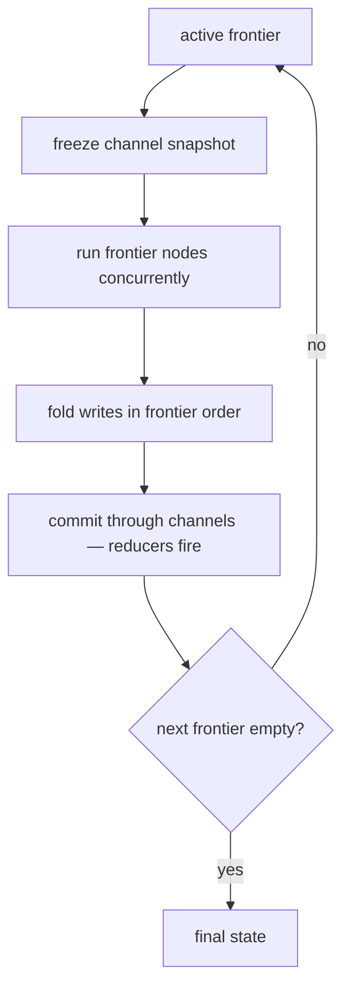
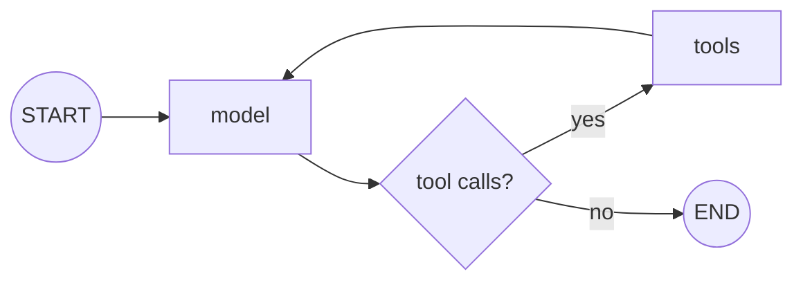
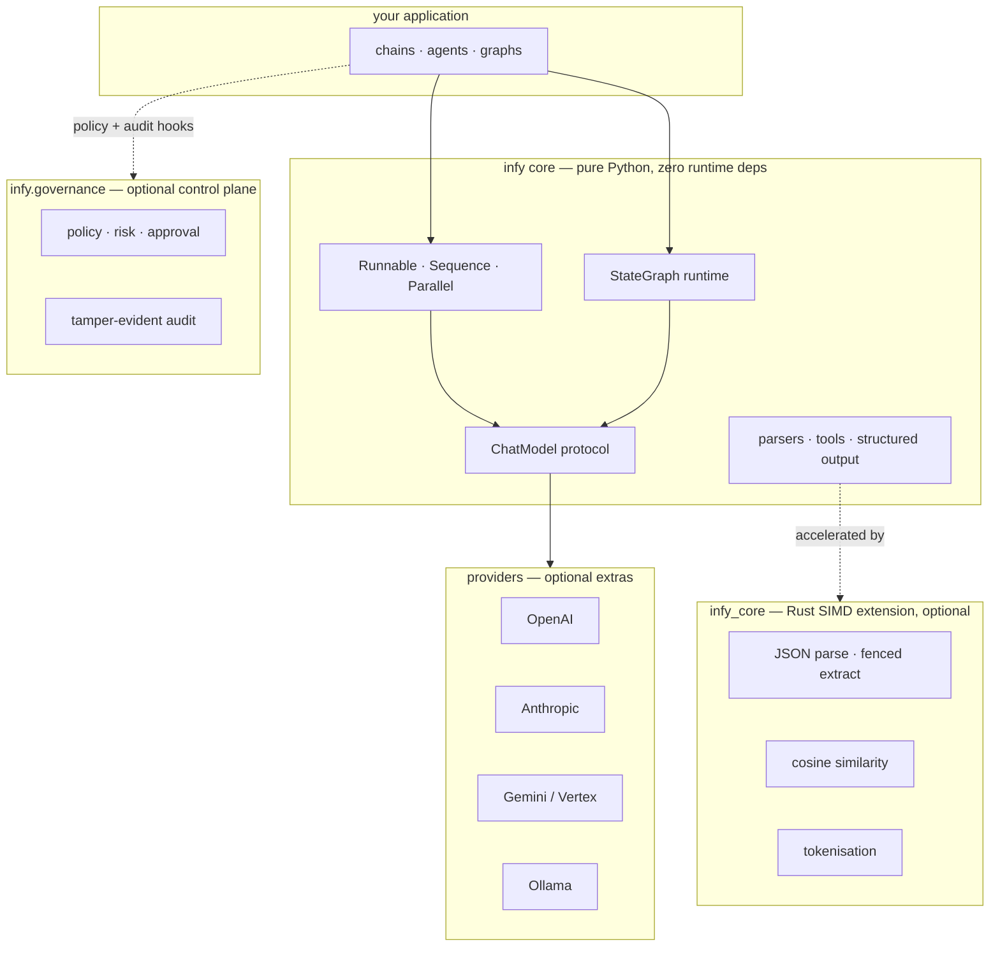

# infy

**A zero-dependency, SIMD-accelerated LLM framework built for speed, safety, and scale.**


[](LICENSE)


infy is a from-scratch runtime for building LLM applications and agentic systems. The
Python core has **no third-party runtime dependencies**; the hot paths (JSON parsing,
similarity, tokenisation) are accelerated by a compiled Rust extension that degrades
gracefully to pure Python when it is not present. It ships a complete chat-model
abstraction, composable runnables, structured output, tool-calling agents, and a
Pregel-style stateful graph executor with checkpointing and human-in-the-loop interrupts —
sync and async throughout.

It is an alternative to LangChain/LangGraph for teams that care about cold-start latency,
memory footprint, and per-invocation overhead: the places where framework weight actually
shows up in production.

---

## Design principles

- **Zero runtime dependencies in the core.** Provider SDKs, pydantic, and the Rust
  extension are all optional. The pure-Python layer runs on a bare interpreter.
- **Async-first, sync-complete.** Every model, runnable, and graph exposes both a sync and
  an async surface with identical semantics. Async graph execution runs each superstep's
  frontier concurrently.
- **A real graph runtime, not a wrapper.** A bulk-synchronous (Pregel-style) superstep
  engine with typed channels, reducers, conditional routing, dynamic fan-out, checkpointing,
  and interrupt/resume — implemented in ~360 lines.
- **Typed and validated.** Strict `mypy`, frozen dataclasses for messages, and
  pydantic-core validation for structured output when (and only when) you opt in.
- **Honest performance.** Speed comes from doing less work per call and from a Rust core for
  the parsing hot path — not from marketing. See [Performance](#performance), including the
  cases where the advantage does *not* matter.

---

## Installation

```bash
pip install infy                 # core + Rust extension (pure-Python fallback if unavailable)

pip install "infy[openai]"       # OpenAI provider
pip install "infy[anthropic]"    # Anthropic provider
pip install "infy[gemini]"       # Google Gemini / Vertex provider
pip install "infy[ollama]"       # Ollama provider
pip install "infy[pydantic]"     # validated structured output
pip install "infy[all]"          # all providers
```

Requires Python 3.10+.

> **Alpha:** until the first tagged PyPI release, install from source — see
> [CONTRIBUTING.md](CONTRIBUTING.md) (`pip install -e ".[dev]" && maturin develop --release`).

---

## Quickstart

```python
from infy import HumanMessage
from infy.providers.openai import OpenAIChat

model = OpenAIChat("gpt-4o")

reply = model.generate([HumanMessage(content="Summarise bulk-synchronous parallelism in one sentence.")])
print(reply.text)
```

The same model exposes `agenerate`, `stream`, and `astream`:

```python
async for chunk in model.astream([HumanMessage(content="Stream me a haiku about schedulers.")]):
    print(chunk.content, end="", flush=True)
```

---

## Composition

Runnables compose with the `|` operator into a `Sequence`. Plain callables, dicts, and tools
are coerced automatically.

```python
from infy import HumanMessage, JsonParser, Lambda

chain = Lambda(lambda topic: [HumanMessage(content=f"Return JSON facts about {topic}.")]) | model | JsonParser()

chain.invoke("the Pregel model")          # sync
await chain.ainvoke("the Pregel model")   # async
```

---

## Structured output

`with_structured_output` accepts either a JSON-schema dict or a pydantic model, and the
return type follows the input:

```python
# JSON schema -> parsed dict (Rust JsonParser, no validation)
extract = model.with_structured_output({
    "type": "object",
    "properties": {"name": {"type": "string"}, "age": {"type": "integer"}},
    "required": ["name", "age"],
})
extract.generate([HumanMessage(content="Maria Chen is 42.")])
# {'name': 'Maria Chen', 'age': 42}

# pydantic model -> validated instance (pydantic-core fused parse+validate)
from pydantic import BaseModel

class Person(BaseModel):
    name: str
    age: int

model.with_structured_output(Person).generate([HumanMessage(content="Maria Chen is 42.")])
# Person(name='Maria Chen', age=42)
```

The schema instruction is computed once and cached. With a pydantic schema, genuinely
invalid output raises `pydantic.ValidationError`; streaming yields partial dicts and defers
validation to the terminal `generate`/`agenerate`.

---

## Tools and agents

```python
from infy import create_agent, tool

@tool
def get_weather(city: str) -> str:
    """Return the current weather for a city."""
    return f"{city}: 17C, clear"

agent = create_agent(model, tools=[get_weather])     # create_async_agent for async
result = agent("What's the weather in Boston?")

print(result.response.text)
print(result.iterations, result.tool_calls_made)
```

`create_agent` is a tight ReAct loop (tool calls executed in parallel by default). For
control flow that branches, loops, persists, or pauses, use the graph runtime.

---

## The graph runtime

`StateGraph` compiles to a bulk-synchronous superstep executor. State is a `TypedDict`;
fields annotated with a reducer accumulate, everything else is last-write-wins. Each
superstep runs the active frontier against one frozen snapshot, commits all writes through
the channels at once (so reducers reduce), then computes the next frontier — which is what
makes real fan-out and diamond joins correct.



```python
import operator
from typing import Annotated, TypedDict

from infy import HumanMessage, StateGraph, START, END, InMemorySaver

# `model` is a ChatModel; `TOOLS` is your tool schema list; `run_tools` is a node that
# executes the tool calls in the last message — all supplied by you.

class State(TypedDict):
    messages: Annotated[list, operator.add]   # reducer: append across supersteps

def call_model(state: State) -> dict:
    return {"messages": [model.generate(state["messages"], tools=TOOLS)]}

def route(state: State) -> str:
    return "tools" if state["messages"][-1].tool_calls else END

graph = StateGraph(State)
graph.add_node("model", call_model)
graph.add_node("tools", run_tools)
graph.add_edge(START, "model")
graph.add_conditional_edges("model", route, {"tools": "tools", END: END})
graph.add_edge("tools", "model")

app = graph.compile()
app.invoke({"messages": [HumanMessage(content="...")]})
```

The graph above is the canonical agent loop:



The compiled graph is sync and async with identical semantics:

```python
await app.ainvoke({"messages": [...]})              # concurrent frontier, deterministic reducers
async for step in app.astream({"messages": [...]}): # state after each superstep
    ...
```

Capabilities:

- **Reducers** — `Annotated[T, reducer]` channels (`operator.add`, custom binary ops) with
  diamond-join de-duplication.
- **Dynamic fan-out** — return `Send(node, arg)` objects from a conditional edge to spawn
  per-item tasks that run concurrently under `ainvoke`.
- **Checkpointing** — `compile(checkpointer=InMemorySaver())` persists channel state and the
  pending frontier per `thread_id`; `get_state` / `update_state` inspect and amend it.
- **Interrupt / resume** — `interrupt_before` / `interrupt_after`, or an in-node
  `NodeInterrupt`, pause execution and persist a resumable checkpoint; re-invoking with the
  same `thread_id` continues. This is the substrate for human-in-the-loop approval.
- **Bounded recursion** — `recursion_limit` raises `GraphRecursionError` instead of looping
  forever.

---

## Governance (optional, in-process)

Giving an agent real authority — shell, deploys, money, customer data — raises one question:
*how do you make that safe, and prove what it did?* infy answers it with an optional control
plane wired into the agent loop. Omit it and nothing changes and nothing is imported; opt in and
every tool call is policy-checked **in-process** (microseconds) and every step is written to a
tamper-evident audit trail.

```python
from infy import create_agent
from infy.governance import Governance, Policy, CallbackApprover

gov = Governance(
    policy=Policy(
        deny=["delete_database"],        # never, regardless of approval
        require_approval=["deploy"],     # allowed only with a human yes
    ),
    approver=CallbackApprover(prompt_via_slack),
    principal="agent://acme/assistant",
)

agent = create_agent(model, tools=[search, deploy, delete_database], governance=gov)
agent("ship the release")

assert gov.audit.verify()      # tamper-evident receipt of everything that happened
```

- **Deny-by-default, fail-closed.** Cedar-style semantics (forbid overrides permit) in pure
  Python behind a `PolicyEngine` protocol. Any error in policy, risk, or approval yields a
  *deny* — and is still audited. There is no path to a silent allow.
- **Risk-tiered.** Tools carry a static risk profile; an unprofiled side-effecting tool is treated
  as HIGH and escalated to a human approver by default.
- **Human approval gate.** A pluggable `Approver` (default `DenyAll`) pauses high-risk calls for a
  human yes/no, recorded in the audit chain.
- **Tamper-evident audit.** An append-only, SHA-256 / HMAC hash-chained log with `verify()` — the
  evidence trail SOC 2 and the EU AI Act expect.
- **Free enough to leave on.** Measured ~50 µs per tool call — about **0.003%** of the LLM call it
  guards. Details and threat model: [`infy/governance/README.md`](infy/governance/README.md).

Enforcement is in-process **by design**: a policy microservice with a network hop before every
tool call would erase infy's cold-start and latency advantage. The heavy, operated pieces —
durable audit, hosted approval queues, multi-tenant policy management — are the commercial layer
(see [Open core](#open-core--whats-commercial)) and attach behind these same protocol seams.

---

## Providers

| Provider | Class | Notes |
| --- | --- | --- |
| OpenAI | `infy.providers.openai.OpenAIChat` | chat, tools, structured output |
| Anthropic | `infy.providers.anthropic.AnthropicChat` | chat, tools, structured output |
| Google Gemini | `infy.providers.gemini.GeminiChat` | AI Studio and Vertex (`vertexai=True`) |
| Ollama | `infy.providers.ollama.OllamaChat` | local models |

Every provider implements the same `ChatModel` protocol — `generate`, `agenerate`, `stream`,
`astream`, `bind_tools`, `with_structured_output` — so they are interchangeable in chains,
agents, and graphs.

---

## Performance

Measured by porting real LangChain/LangGraph projects to infy and isolating framework
overhead (deterministic, offline model leaves — only the orchestration differs). Both ports
are verified to produce byte-identical output before any number is trusted.

| Dimension | infy vs LangChain/LangGraph |
| --- | --- |
| Cold start (import + compile) | **2.7x–6.8x faster** |
| Resident memory | **2.7x–5.5x lower** |
| Per-invocation framework overhead | **12x–93x lower** |
| Orchestration LOC | parity to moderately smaller |

Cold start, infy x faster:

```
terminal_agent  ██████████████████████████████  6.78x
DATAGEN         █████████████████████████        5.55x
medical         ████████████████████             4.48x
swe-agent       ██████████████████               3.98x
hedge-fund      ████████████████                 3.63x
billed-native   ████████████                     2.75x
```

A representative live, billed run against `gemini-2.5-flash` on Vertex AI — native provider
vs native provider — was **2.75x faster cold start** and used **~3.7x less resident memory**
(73 MB vs 270 MB).

**The honest caveat.** Per-invocation overhead multiples are real but **amortise into network
latency** once a live model call dominates the request — end-to-end wall-clock between
frameworks is effectively at parity in that regime. The advantages that remain visible in
production are **cold start and memory footprint**, which is precisely why infy targets
serverless, edge, and high-density multi-tenant deployments where those costs are paid on
every request and per running agent.

Full methodology, per-project numbers, the component-level LCEL/parser tax, and the cases
where infy *loses*: **[BENCHMARKS.md](BENCHMARKS.md)**.

---

## Architecture



- **Pure-Python core** (`infy/`) — messages, models, runnables, parsers, tools, agents, the
  graph runtime, RAG, retrievers, memory. No third-party imports.
- **Rust extension** (`infy_core`, built with maturin/PyO3, `abi3` for a single wheel across
  Python 3.10+) — SIMD-assisted JSON parsing and markdown-fenced JSON extraction, cosine
  similarity, and tokenisation. Runtime CPU-feature detection selects the SIMD path.
- **Optional governance** (`infy.governance`) — an in-process policy / risk / approval / audit
  control plane that hooks the agent loop. Not imported by the core until you use it.
- **Graceful degradation** — every module that uses the extension falls back to a pure-Python
  implementation, so the framework is fully functional with the extension absent.

```
infy/            pure-Python framework (zero runtime deps)
  graph/         StateGraph, channels, checkpointing, interrupts
  governance/    optional in-process control plane (policy, risk, approval, audit)
  providers/     OpenAI, Anthropic, Gemini, Ollama
core-rust/       Rust SIMD extension (infy_core)
tests/           strict mypy, ruff, pytest
```

---

## Open core & what's commercial

infy is **open core**, Apache-2.0. Everything in this repository is free to use, self-host, and
build on — forever. That includes the **in-process governance library**: the policy engine, risk
tiering, the approval-gate primitive, and the local tamper-evident audit log (with `verify()`).
The enforcement code is open *on purpose* — a control plane you cannot read is one you cannot
trust.

The commercial layer (operated by [Infyrence](https://infyrence.com), **not** in this repo) is the
*managed* surface that begins where in-process ends — at the network boundary:

| Open — Apache-2.0, this repo | Commercial — Infyrence cloud |
| --- | --- |
| In-process policy / risk / approval primitives | Multi-tenant policy management, versioning, RBAC |
| Local hash-chained audit + `verify()` | Durable WORM-anchored audit sink (tamper-*proof*), retention, query |
| `Approver` protocol + callbacks | Hosted approval inbox (Slack / web), identity capture, four-eyes |
| `PolicyEngine` protocol seam | Embedded Cedar engine, YAML→policy authoring DSL, compliance packs |

Commercial features attach **behind the same open protocol seams** (`PolicyEngine`, `Approver`,
the audit interface) — no fork, and no lock-in at the enforcement boundary.

---

## Roadmap

The governance MVP — in-process enforcement, the approval gate, and tamper-evident audit — ships
today. Deliberately deferred (behind the stable protocol seams above, until a design partner pulls
them): an embedded Cedar engine compiled into `infy_core`, a YAML→policy DSL, taint/provenance and
egress DLP for prompt-injection defense, plan-level authorization, governance on the graph path,
and capability attenuation across sub-agents.

---

## Project status

Alpha. The model, runnable, structured-output, tool, agent, graph, and governance APIs are stable
and covered by the test suite (strict `mypy`, `ruff`, 327 passing; 8 skipped without provider
SDKs). Surface area is deliberately
smaller than LangChain — there is no prompt-template DSL, no `MessagesState` helper, and the
provider/integration catalogue is focused rather than exhaustive. Treat minor releases as
potentially breaking until 1.0.

---

## Development

The project uses a Rust extension, so a release build of the core is required for the full
test suite and for accurate performance.

```bash
# build the Rust core into the active environment (release; debug builds fail perf checks)
maturin develop --release

# quality gates
ruff check infy tests examples
ruff format --check infy tests examples
mypy infy
pytest -q
```

See [CONTRIBUTING.md](CONTRIBUTING.md) for the full workflow and the Developer Certificate of
Origin, and [SECURITY.md](SECURITY.md) to report a vulnerability.

---

## License

[Apache-2.0](LICENSE) © 2026 Hujjat Mosavinejad (Infyrence). See [NOTICE](NOTICE) for attribution
and the open-core boundary.
