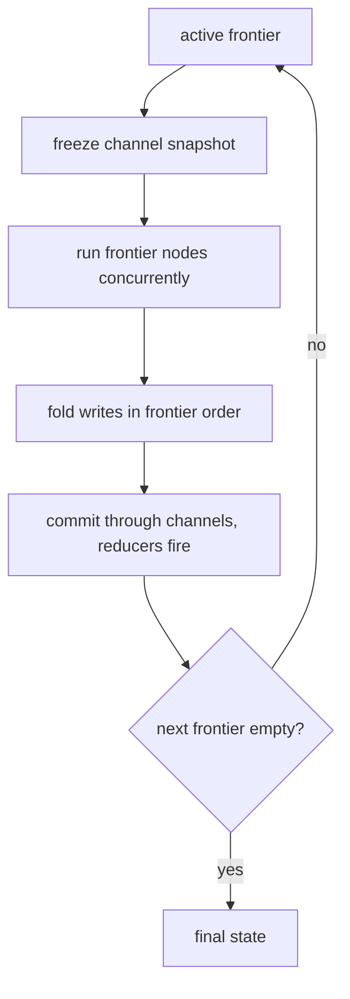
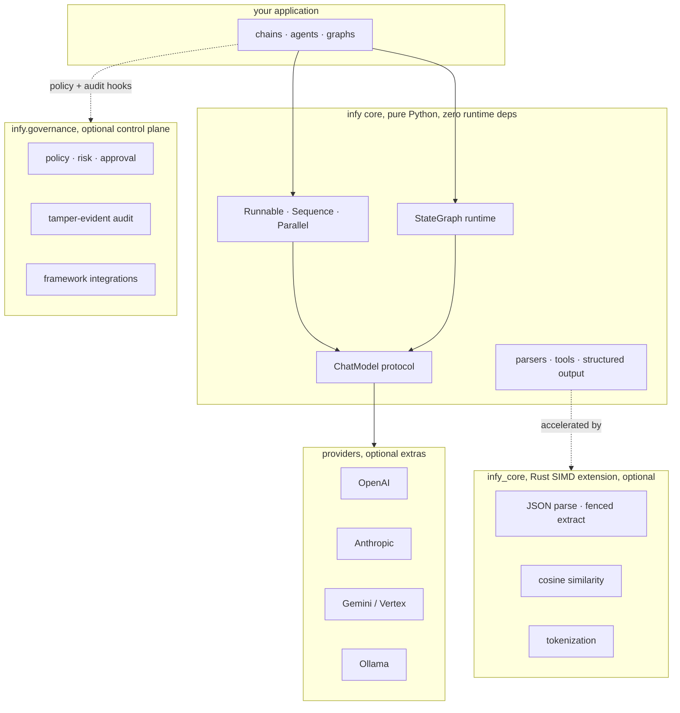

# infy

**A zero-dependency, Rust-accelerated framework for building AI agents, with an in-process governance layer that makes it safe to give them real authority.**


[](LICENSE)


infy is a from-scratch runtime for LLM applications and agentic systems. The Python core has **no third-party runtime dependencies**; the hot paths (JSON parsing, similarity, tokenization) are accelerated by a compiled Rust extension that degrades gracefully to pure Python when it is absent. It ships a complete chat-model abstraction, composable runnables, structured output, tool-calling agents, and a Pregel-style stateful graph executor with checkpointing and human-in-the-loop interrupts, sync and async throughout.

Two things set it apart:

1. **Weight.** infy is built for the costs that actually show up in production, cold-start latency, memory footprint, and per-invocation overhead, which is where LangChain and LangGraph are heaviest. Across a corpus of real agents it runs a median of **8.6x faster on cold start** and **5.4x lighter on memory** at line-of-code parity (see [Performance](#performance)).
2. **Control.** An optional, in-process governance layer policy-checks every tool call and writes a tamper-evident audit, so an agent can be given real authority (shell, deploys, money, customer data) safely, and prove what it did. That same governance wraps agents built on **other frameworks** too (see [Integrations](#integrations-govern-any-agent)).

---

## Design principles

- **Zero runtime dependencies in the core.** Provider SDKs, pydantic, and the Rust extension are all optional. The pure-Python layer runs on a bare interpreter.
- **Async-first, sync-complete.** Every model, runnable, and graph exposes both a sync and an async surface with identical semantics. Async graph execution runs each superstep's frontier concurrently.
- **A real graph runtime, not a wrapper.** A bulk-synchronous (Pregel-style) superstep engine with typed channels, reducers, conditional routing, dynamic fan-out, checkpointing, and interrupt or resume, implemented in about 360 lines.
- **Safe by construction.** Governance is deny-by-default and fail-closed, enforced in-process at the tool chokepoint, with a hash-chained audit you can verify.
- **Typed and validated.** Strict `mypy`, frozen dataclasses for messages, and pydantic-core validation for structured output when, and only when, you opt in.
- **Honest performance.** Speed comes from doing less work per call and from a Rust core for the parsing hot path, not from marketing. See [Performance](#performance), including the cases where the advantage does not matter.

---

## Installation

```bash
pip install infy                 # core + Rust extension (pure-Python fallback if unavailable)

pip install "infy[openai]"       # OpenAI provider
pip install "infy[anthropic]"    # Anthropic provider
pip install "infy[gemini]"       # Google Gemini / Vertex provider
pip install "infy[ollama]"       # Ollama provider
pip install "infy[pydantic]"     # validated structured output
pip install "infy[all]"          # all providers
```

Requires Python 3.10+.

> **Alpha:** until the first tagged PyPI release, install from source. See [CONTRIBUTING.md](CONTRIBUTING.md) (`pip install -e ".[dev]" && maturin develop --release`).

---

## Quickstart

```python
from infy import HumanMessage
from infy.providers.openai import OpenAIChat

model = OpenAIChat("gpt-4o")

reply = model.generate([HumanMessage(content="Summarize bulk-synchronous parallelism in one sentence.")])
print(reply.text)
```

The same model exposes `agenerate`, `stream`, and `astream`:

```python
async for chunk in model.astream([HumanMessage(content="Stream me a haiku about schedulers.")]):
    print(chunk.content, end="", flush=True)
```

---

## Tools and agents

```python
from infy import create_agent, tool

@tool
def get_weather(city: str) -> str:
    """Return the current weather for a city."""
    return f"{city}: 17C, clear"

agent = create_agent(model, tools=[get_weather])     # create_async_agent for async
result = agent("What's the weather in Boston?")

print(result.response.text)
print(result.iterations, result.tool_calls_made)
```

`create_agent` is a tight ReAct loop (tool calls executed in parallel by default). For control flow that branches, loops, persists, or pauses, use the [graph runtime](#the-graph-runtime).

---

## Governance: safe agents you can prove

Giving an agent real authority (shell, deploys, money, customer data) raises one question: how do you make that safe, and prove what it did? infy answers it with an optional control plane wired into the agent loop. Omit it and nothing changes and nothing is imported. Opt in and every tool call is policy-checked **in-process** (microseconds), and every step is written to a tamper-evident audit trail.

```python
from infy import create_agent
from infy.governance import Governance, Policy, CallbackApprover

gov = Governance(
    policy=Policy(
        deny=["delete_database"],        # never, regardless of approval
        require_approval=["deploy"],     # allowed only with a human yes
    ),
    approver=CallbackApprover(prompt_via_slack),
    principal="agent://acme/assistant",
)

agent = create_agent(model, tools=[search, deploy, delete_database], governance=gov)
agent("ship the release")

assert gov.audit.verify()      # tamper-evident receipt of everything that happened
```

- **Deny-by-default, fail-closed.** Cedar-style semantics (forbid overrides permit) in pure Python behind a `PolicyEngine` protocol. Any error in policy, risk, or approval yields a deny, and is still audited. There is no path to a silent allow.
- **Risk-tiered.** Tools carry a static risk profile; an unprofiled side-effecting tool is treated as HIGH and escalated to a human approver by default.
- **Human approval gate.** A pluggable `Approver` (default `DenyAll`) pauses high-risk calls for a human yes or no, recorded in the audit chain.
- **Durable approval.** For sign-off that cannot happen inline, `DurableAgent` suspends a run, persists it, and resumes minutes or hours later once a human decides, with each approval cryptographically bound to the exact action (TOCTOU-safe).
- **Tamper-evident audit.** An append-only, SHA-256 or HMAC hash-chained log with `verify()`, the evidence trail SOC 2 and the EU AI Act expect.
- **Free enough to leave on.** Measured at about 50 microseconds per tool call, roughly **0.003%** of the LLM call it guards. Details and threat model: [`infy/governance/README.md`](infy/governance/README.md).

Durable, out-of-band approval in three lines:

```python
from infy.governance import DurableAgent, DurableApprover, InMemoryApprovalStore

store = InMemoryApprovalStore()
agent = DurableAgent(model, tools, governance=gov_with(DurableApprover(store)), store=store)

result = agent.run("release the payment", run_id="run-1")
if result.status == "suspended":                       # paused, nothing risky has run
    fp = result.pending_approvals[0].fingerprint
    result = agent.resume("run-1", {fp: True})         # a human approved, hours later
```

Enforcement is in-process **by design**. A policy microservice with a network hop before every tool call would erase infy's cold-start and latency advantage. The heavy, operated pieces (durable audit sinks, hosted approval queues, multi-tenant policy management) are the commercial layer (see [Open core](#open-core-and-what-is-commercial)) and attach behind these same protocol seams.

---

## Integrations: govern any agent

infy governance is not limited to infy agents. `infy.integrations` wraps the tool or action chokepoint of popular frameworks, so you can add deny-by-default policy, human approval, and a tamper-evident audit to agents you already run, without changing them.

```python
from smolagents import ToolCallingAgent
from infy.governance import Governance, Policy, CallbackApprover
from infy.integrations.smolagents import govern

gov = Governance(
    policy=Policy(allow=["read_file", "run_shell"], deny=["delete_all"], require_approval=["run_shell"]),
    approver=CallbackApprover(ask_a_human),
)

# Same tools, now governed. The agent is unchanged.
agent = ToolCallingAgent(tools=govern(my_tools, gov), model=model)
```

A denied action never runs; the model receives the block reason and adapts. Every decision lands in the same hash-chained audit you can `verify()`.

| Framework | Adapter | Status |
| --- | --- | --- |
| smolagents | `infy.integrations.smolagents.govern` | Tested against the library, runnable demo |
| LangChain | `infy.integrations.langchain.govern` | Tested against the library, runnable demo |
| OpenHands | `infy.integrations.openhands.build_analyzer` | Adapter for its `SecurityAnalyzer` hook |

Runnable demos, including a real smolagents agent that has a destructive action denied and a deploy paused for a human, are in [`examples/`](examples/).

---

## Composition and structured output

Runnables compose with the `|` operator into a `Sequence`; plain callables, dicts, and tools are coerced automatically.

```python
from infy import HumanMessage, JsonParser, Lambda

chain = Lambda(lambda topic: [HumanMessage(content=f"Return JSON facts about {topic}.")]) | model | JsonParser()

chain.invoke("the Pregel model")          # sync
await chain.ainvoke("the Pregel model")   # async
```

`with_structured_output` accepts either a JSON-schema dict (parsed by the Rust `JsonParser`, no validation) or a pydantic model (pydantic-core fused parse and validate). The return type follows the input, and the schema instruction is computed once and cached.

```python
from pydantic import BaseModel

class Person(BaseModel):
    name: str
    age: int

model.with_structured_output(Person).generate([HumanMessage(content="Maria Chen is 42.")])
# Person(name='Maria Chen', age=42)
```

---

## The graph runtime

`StateGraph` compiles to a bulk-synchronous superstep executor. State is a `TypedDict`; fields annotated with a reducer accumulate, everything else is last-write-wins. Each superstep runs the active frontier against one frozen snapshot, commits all writes through the channels at once (so reducers reduce), then computes the next frontier, which is what makes real fan-out and diamond joins correct.



```python
import operator
from typing import Annotated, TypedDict

from infy import HumanMessage, StateGraph, START, END, InMemorySaver

class State(TypedDict):
    messages: Annotated[list, operator.add]   # reducer: append across supersteps

def call_model(state: State) -> dict:
    return {"messages": [model.generate(state["messages"], tools=TOOLS)]}

def route(state: State) -> str:
    return "tools" if state["messages"][-1].tool_calls else END

graph = StateGraph(State)
graph.add_node("model", call_model)
graph.add_node("tools", run_tools)
graph.add_edge(START, "model")
graph.add_conditional_edges("model", route, {"tools": "tools", END: END})
graph.add_edge("tools", "model")

app = graph.compile()
app.invoke({"messages": [HumanMessage(content="...")]})
```

The compiled graph is sync and async with identical semantics:

```python
await app.ainvoke({"messages": [...]})              # concurrent frontier, deterministic reducers
async for step in app.astream({"messages": [...]}): # state after each superstep
    ...
```

Capabilities:

- **Reducers.** `Annotated[T, reducer]` channels (`operator.add`, custom binary ops) with diamond-join de-duplication.
- **Dynamic fan-out.** Return `Send(node, arg)` objects from a conditional edge to spawn per-item tasks that run concurrently under `ainvoke`.
- **Checkpointing.** `compile(checkpointer=InMemorySaver())` persists channel state and the pending frontier per `thread_id`; `get_state` and `update_state` inspect and amend it.
- **Interrupt and resume.** `interrupt_before` or `interrupt_after`, or an in-node `NodeInterrupt`, pause execution and persist a resumable checkpoint; re-invoking with the same `thread_id` continues.
- **Bounded recursion.** `recursion_limit` raises `GraphRecursionError` instead of looping forever.

---

## Providers

| Provider | Class | Notes |
| --- | --- | --- |
| OpenAI | `infy.providers.openai.OpenAIChat` | chat, tools, structured output |
| Anthropic | `infy.providers.anthropic.AnthropicChat` | chat, tools, structured output |
| Google Gemini | `infy.providers.gemini.GeminiChat` | AI Studio and Vertex (`vertexai=True`) |
| Ollama | `infy.providers.ollama.OllamaChat` | local models |

Every provider implements the same `ChatModel` protocol (`generate`, `agenerate`, `stream`, `astream`, `bind_tools`, `with_structured_output`), so they are interchangeable in chains, agents, and graphs.

---

## Performance

Framework overhead is isolated by porting real LangChain and LangGraph projects to infy over a shared, deterministic, offline leaf (no API keys, no GPU, no network), and verifying **byte-identical output** before any number is trusted. Only the orchestration differs between the two ports, so the difference is the framework.

Across a corpus of about **37 community agents**, median:

| Dimension | infy vs LangChain / LangGraph |
| --- | --- |
| Cold start (import + compile) | **8.6x faster** |
| Resident memory | **5.4x lighter** |
| Per-invocation framework overhead | **21x lower** |
| Orchestration LOC | parity |

Conservative view, on seven heavier real projects: **2.7x to 6.8x** faster cold start, **2.7x to 5.5x** lower memory, and **12x to 93x** lower per-call overhead.

**The honest caveat.** Per-invocation multiples are real, but they amortize into network latency once a live model call dominates the request, so end-to-end wall clock between frameworks is at parity (measured at **1.05x to 1.14x** on a live, billed run). What survives to production is **cold start and memory footprint**, paid on every request and per running agent, which is exactly why infy targets serverless, edge, and high-density multi-tenant deployments.

Full methodology, per-project numbers, the component-level parser tax, and the cases where infy loses: **[BENCHMARKS.md](BENCHMARKS.md)**.

---

## Architecture



```
infy/            pure-Python framework (zero runtime deps)
  graph/         StateGraph, channels, checkpointing, interrupts
  governance/    optional in-process control plane (policy, risk, approval, audit)
  integrations/  govern smolagents, LangChain, and OpenHands agents
  providers/     OpenAI, Anthropic, Gemini, Ollama
core-rust/       Rust SIMD extension (infy_core)
tests/           strict mypy, ruff, pytest
```

Every module that uses the Rust extension falls back to a pure-Python implementation, so the framework is fully functional with the extension absent.

---

## Open core and what is commercial

infy is **open core**, Apache-2.0. Everything in this repository is free to use, self-host, and build on, forever. That includes the **in-process governance library**: the policy engine, risk tiering, the approval-gate and durable-approval primitives, and the local tamper-evident audit log with `verify()`. The enforcement code is open on purpose, because a control plane you cannot read is one you cannot trust.

The commercial layer (operated by [Infyrence](https://infyrence.com), **not** in this repo) is the managed surface that begins where in-process ends, at the network boundary:

| Open, Apache-2.0, this repo | Commercial, Infyrence cloud |
| --- | --- |
| In-process policy, risk, approval primitives | Multi-tenant policy management, versioning, RBAC |
| Local hash-chained audit and `verify()` | Durable, WORM-anchored audit sink (tamper-proof), retention, query |
| `Approver` protocol and callbacks | Hosted approval inbox (Slack, web), identity capture, four-eyes |
| `PolicyEngine` protocol seam | Embedded Cedar engine, policy-authoring DSL, compliance packs |

Commercial features attach behind the same open protocol seams (`PolicyEngine`, `Approver`, the audit interface). No fork, and no lock-in at the enforcement boundary.

---

## Project status

Alpha. The model, runnable, structured-output, tool, agent, graph, governance, and integration APIs are stable and covered by the test suite (strict `mypy`, `ruff`, 356 passing, 8 skipped without optional SDKs). Surface area is deliberately smaller than LangChain: there is no prompt-template DSL and the provider catalogue is focused rather than exhaustive. Treat minor releases as potentially breaking until 1.0.

Deferred behind the stable protocol seams, until a design partner pulls them: an embedded Cedar engine compiled into `infy_core`, a YAML-to-policy DSL, taint and provenance with egress DLP for prompt-injection defense, plan-level authorization, and capability attenuation across sub-agents.

---

## Development

The project uses a Rust extension, so a release build of the core is required for the full test suite and for accurate performance.

```bash
# build the Rust core into the active environment (release; debug builds fail perf checks)
maturin develop --release

# quality gates
ruff check infy tests examples
ruff format --check infy tests examples
mypy infy
pytest -q
```

See [CONTRIBUTING.md](CONTRIBUTING.md) for the full workflow and the Developer Certificate of Origin, and [SECURITY.md](SECURITY.md) to report a vulnerability.

---

## License

[Apache-2.0](LICENSE) © 2026 Infyrence. See [NOTICE](NOTICE) for attribution and the open-core boundary.
